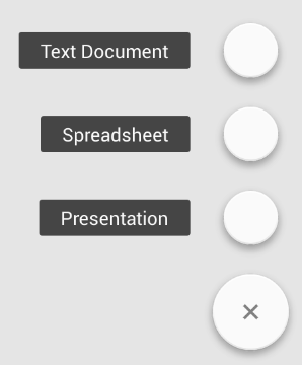

FloatingActionButton
====================
Yet another library for drawing [Material Design promoted actions](http://www.google.com/design/spec/patterns/promoted-actions.html).

Features
========
* Support for normal `56dp` and mini `40dp` buttons.

  

* Customizable background colors for normal and pressed states and icon drawable.

  

* Convenience `AddFloatingActionButton` class with plus icon drawn in code.
* `FloatingActionsMenu` which can be expanded/collapsed to reveal multiple actions.

  

* Optional labels for buttons in `FloatingActionsMenu`.

  

Usage
=====
Just add the dependency to your `build.gradle`:

```groovy
dependencies {
    compile 'com.getbase:floatingactionbutton:1.10.1'
}
```

To see how the buttons are added to your xml layouts, check the sample project.

Caveats
=======
The API is **extremely** limited at the moment. It solves few select use cases in the app I'm working on.

Unlike some other FloatingActionButton libraries this library doesn't implement "quick return" pattern, i.e. hiding the button on scrolling down and showing it on scrolling up. That's intentional, I think that should be responsibility of another component, not the button itself.

This library is `minSdkVersion=14` and if that changes, the version number will be increased, not decreased. It means that Honeycomb, Gingerbread or - gods forbid - Froyo, won't ever be supported. I won't even consider merging pull requests fully implementing support for older versions. We need to move on as Android community and focus on delivering value for 95% of users of modern Android OS instead of jumping through burning hoops to support ancient devices with ancient OS.

If you **really** require support for older Android versions, [str4d](https://github.com/str4d) maintains [a version of this library with `minSdkVersion=4`](https://github.com/str4d/android-floating-action-button).

Credits
=======
I used [FloatingActionButton](https://github.com/makovkastar/FloatingActionButton) library by [Oleksandr Melnykov](https://github.com/makovkastar) as a base for development.

## Copyright and license

Copyright 2014 Zendesk

Licensed under the [Apache License, Version 2.0](LICENSE)
